# Statistical Exploration and Model Evidence Summary

This report collects reproducible figures generated from saved project outputs. It is intended to support scientific review by showing how compounds moved through curation, feature engineering, model evaluation, and ZINC22 hit triage.

## Source Files

- `data/processed/kras_curation_summary.json`
- `data/processed/kras_model_matrix.csv`
- `data/processed/kras_druglikeness_summary.json`
- `data/processed/model_metrics.csv`
- `data/processed/holdout_predictions.csv`
- `data/processed/cross_validation_metrics.csv`
- `data/processed/confusion_matrices/*.csv`
- `data/processed/interpretation/feature_importance.csv`
- `data/processed/batch_screening/ranked_screening_results.csv`
- `data/processed/batch_screening/hit_triage/hit_triage_summary.json`

## Key Counts

- ChEMBL raw records curated: `17,063`
- Labeled active/inactive training records: `1,398`
- Active training records: `1,092`
- Inactive training records: `306`
- Project drug-like records: `817`
- ZINC22 compounds screened: `5,000`
- ZINC22 candidates passing hit-triage criteria: `4`

## Model Evidence

The best holdout model in the saved comparison is `xgboost` with ROC-AUC `0.984`, PR-AUC `0.996`, F1 `0.964`, and recall `0.977`.
Five-fold cross-validation for XGBoost produced mean ROC-AUC `0.968` with standard deviation `0.008`.

## Generated Figures

### Activity-class balance

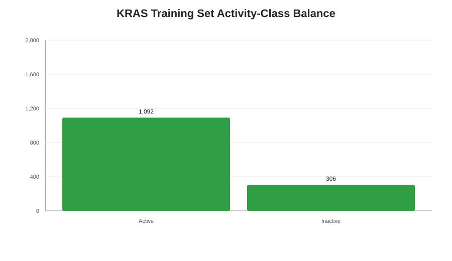

### ChEMBL curation funnel

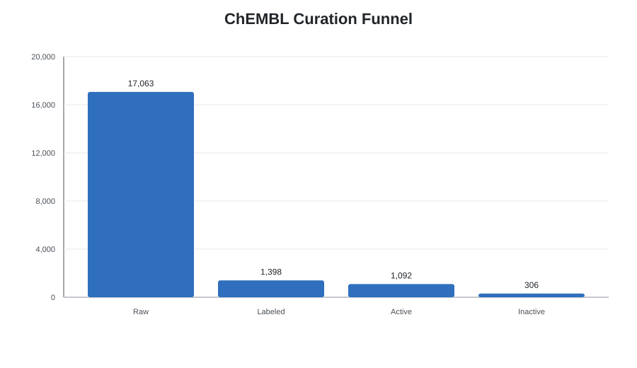

### Target and mutation distribution

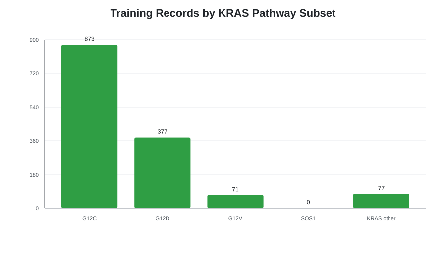

### Drug-likeness filter summary

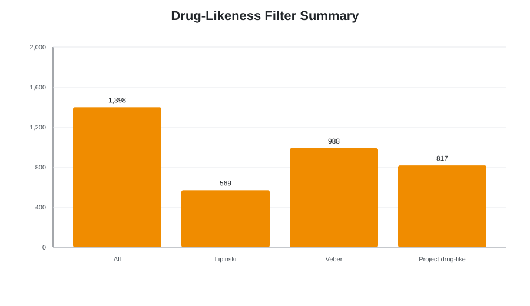

### Molecular property distributions

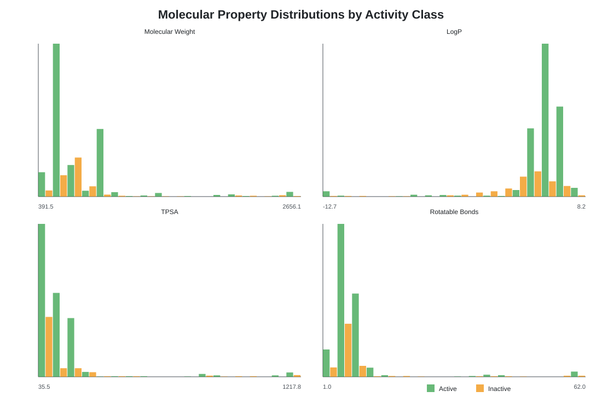

### Lipinski violation counts

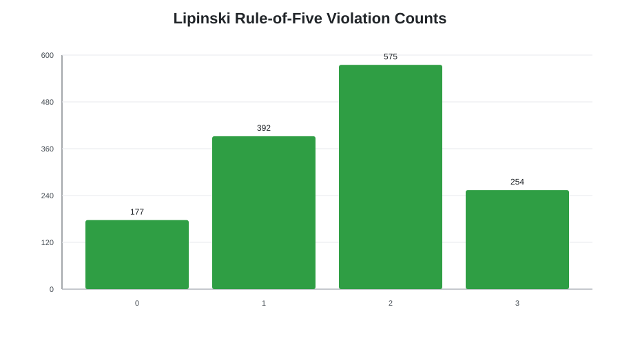

### Holdout model metric comparison

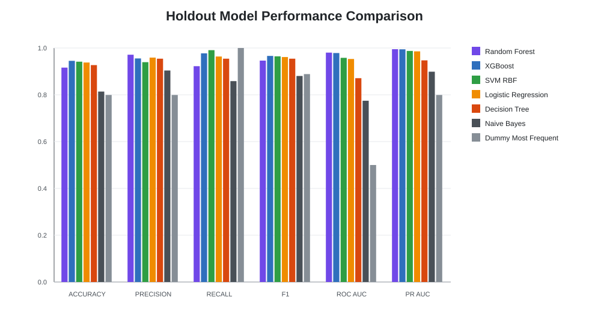

### Cross-validation ROC-AUC comparison

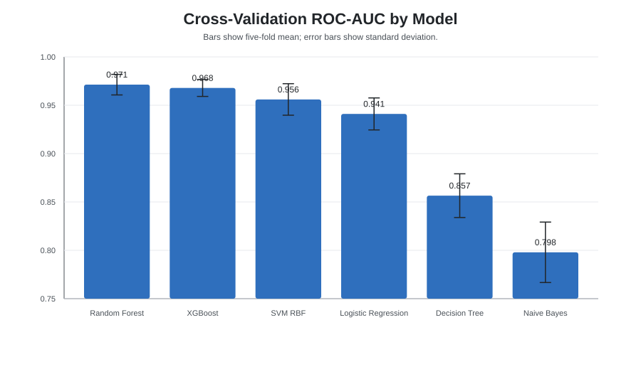

### Holdout ROC curves

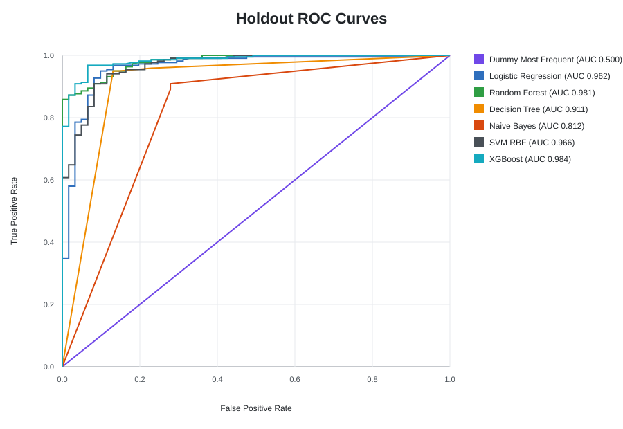

### Holdout precision-recall curves

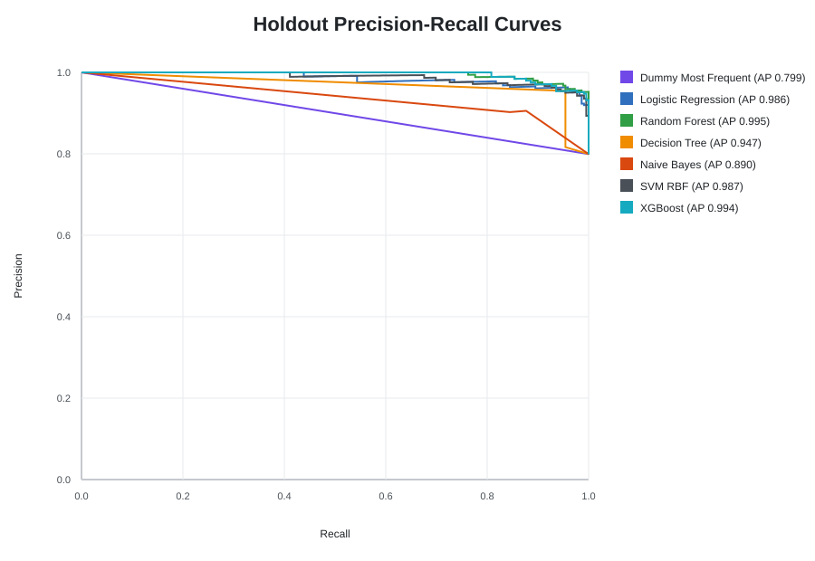

### Holdout confusion matrices

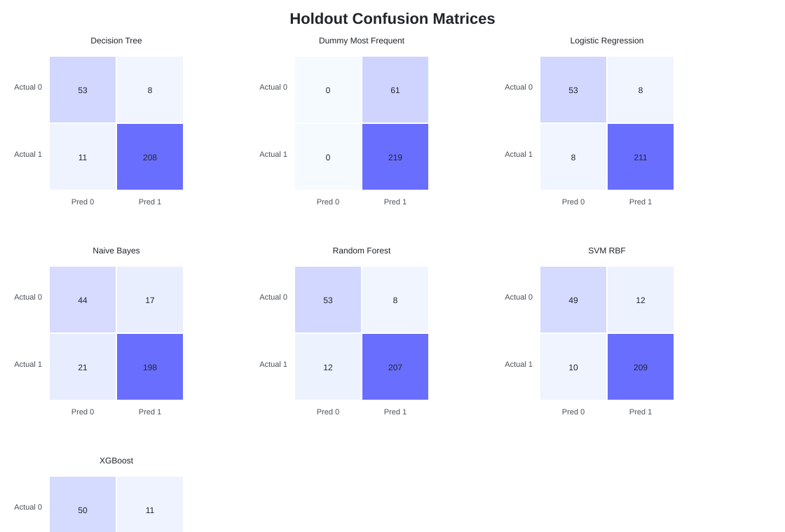

### Top model feature importance

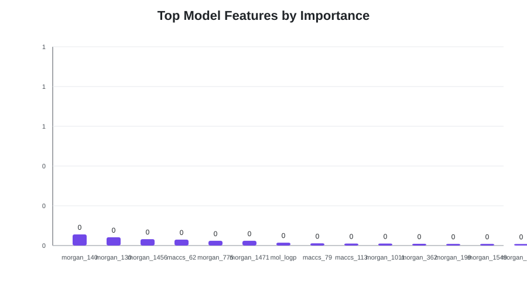

### ZINC22 hit triage funnel

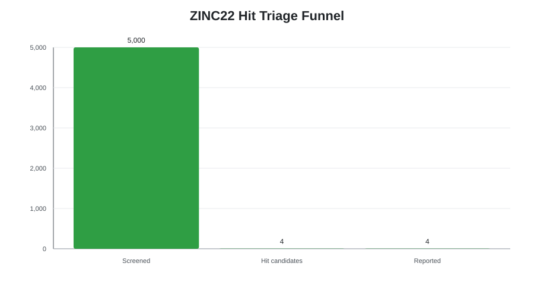

### ZINC22 probability versus ADMET

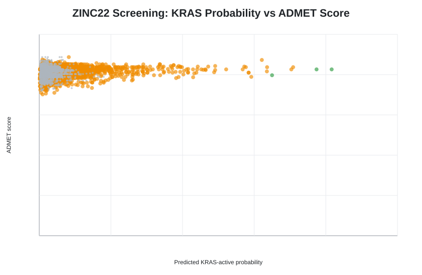

### ZINC22 recommendation distribution

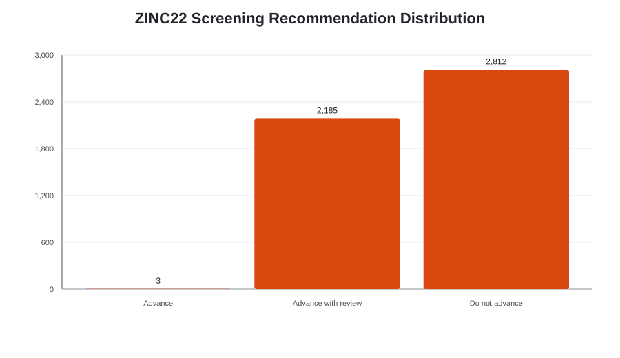

## Notes and Limitations

- These figures are generated from saved project artifacts, not from a fresh ChEMBL or ZINC22 download.
- ROC and precision-recall curves are generated when `data/processed/holdout_predictions.csv` is available. Rerun model training first if that file is missing.
- The ZINC22 hit triage results are computational predictions and should be treated as prioritization evidence for docking, molecular dynamics, medicinal chemistry review, and experimental validation.

## Reproduce

```bash
python -m kras_discovery.visualization.static_plots
```
